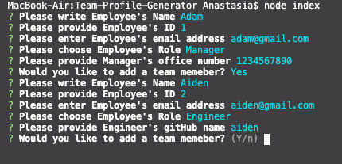

# Team-Profile-Generator

## Table of contents
 * [General info](#General-Info)
 * [Specifics](#Specifics)
 * [Video Link](#Video-Link)
 * [Screenshots](#Screenshots)
 * [Application Code](#Application-Code)
 * [Comments](#Comments)

 
 
 # General Info

   An application was built in order to create “My Team” where user can add multiple members with certain description based on the role, including the links to contact them or view the GitHub account.

 # Specifics

   Application includes tests that can be run by typing in integrated terminal “npm run test”. User can access questions to generate html file by typing “node index.js” in integrated terminal. User will be presented with number of questions. If no value will be entered same question will be repeated. User has an option to finish building a team or continue to add new members. HTML file will be generated for a user with information that was provided. When user click on email, default email program will be opened. When user click on GitHub, link will be opened in new tab. 

 # Video Link

   You can view a demo of the generator by following the link [https://youtu.be/7xoFm-a2e3M](https://youtu.be/7xoFm-a2e3M)

 # Screenshots

   Test Pass

   

   Test Failed 

   Number was changed to a letter to check if test fail

   

   
   Questions example
    
   Choose role

   

   Add more members Y/N

   

   Questions based on different roles

   

   Adding is finished

   

   Team members page example

   

   Clicking on email

   

 # Application Code

   To view application code, please follow the link [https://github.com/sheymanidze/Team-Profile-Generator](https://github.com/sheymanidze/Team-Profile-Generator)

# Comments

  More questions regarding team members can be added in order to have fuller profiles. Links for the parts that team members are working on can be added in order to have quick access to their work. More restictions and if statement will be added that will lead to more tests will be applied. Design can be adjusted based on the companies’ colors. More tests can be added that include more specifications.